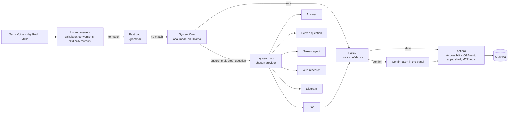

# RedOS

[](https://github.com/Carassale/redos/actions/workflows/ci.yml)
[](https://github.com/Carassale/redos/releases)

[](LICENSE)

**RedOS is an AI assistant for macOS that lives in the menu bar.** Type or say what you want, in Italian
or English, and RedOS opens apps, clicks buttons, fills fields, answers questions about what is on your
screen, searches the web, draws diagrams and runs your routines. Simple commands are understood on your
Mac in about a second; harder ones go to the AI provider you choose (local or cloud). Anything that
changes something asks first, and a kill switch stops everything at once.

```text
⌥ Space  →  "open Safari and go to apple.com"              → opens Safari on apple.com
"Hey Red" →  "summarize the article on screen"             → reads the page and answers
⌥ Space  →  "draw the login flow with two-factor auth"    → opens an HTML/SVG diagram
```

## Contents

- [Features](#features)
- [Requirements](#requirements)
- [Installation](#installation)
- [Setup](#setup)
- [Usage](#usage)
  - [Talking to RedOS](#talking-to-redos)
  - [Controlling the Mac](#controlling-the-mac)
  - [Questions and answers](#questions-and-answers)
  - [Questions about the screen](#questions-about-the-screen)
  - [Multi-step tasks and the screen agent](#multi-step-tasks-and-the-screen-agent)
  - [Diagrams and charts](#diagrams-and-charts)
  - [Routines and triggers](#routines-and-triggers)
  - [Memory and selected text](#memory-and-selected-text)
- [MCP integrations](#mcp-integrations)
- [Settings](#settings)
- [How it works](#how-it-works)
- [Privacy and safety](#privacy-and-safety)
- [Files and data](#files-and-data)
- [Troubleshooting](#troubleshooting)
- [Development](#development)
- [Releases and updates](#releases-and-updates)
- [Roadmap](#roadmap)
- [License and credits](#license-and-credits)

## Features

- **Text and voice**: command panel on **⌥ Space**, push-to-talk on **⌃⌥ Space**, wake word **“Hey Red”**.
  Speech is recognized on the Mac (SpeechAnalyzer); answers can be read aloud.
- **Mac control**: open and quit apps, open websites, type text, click, scroll, press buttons and fill
  fields by name (Accessibility), read the screen, run shell commands (always confirmed).
- **Fast and local first**: a deterministic fast path and a small local model (Ollama, *System One*)
  handle everyday commands offline in about a second.
- **AI provider of your choice** (*System Two*) for questions and multi-step tasks: Ollama (local),
  GitHub Copilot, OpenAI, Anthropic Claude or Google Gemini.
- **Screen questions**: “what does this page say about pricing?”, “summarize this email” —
  answered by reading the frontmost window, never by acting on it.
- **Screen agent**: tasks like “open the second result” look at the screen, act, and repeat, with a HUD
  showing each step and a kill switch (**⌃⌥ Esc**).
- **Web research** with sources, images and charts: news, weather, exchange rates, any web page — no API keys.
- **Instant answers**: arithmetic, percentages, unit and currency conversions without any model.
- **Diagrams**: flowcharts, sequences, timelines, quadrants and 40 more types as self-contained HTML/SVG.
- **Routines** with time and app-launch triggers, **memory** of personal facts, actions on **selected text**.
- **MCP**: other apps (VS Code, Claude Code…) can drive RedOS, and RedOS can use the tools of any MCP server.
- **Guided setup**, automatic **updates** (Sparkle, stable and beta channels), **audit log** of every command.
- Italian and English interface and commands.

## Requirements

| | |
|---|---|
| macOS | 26 (Tahoe) or later, Apple Silicon |
| Memory | 16 GB or more for the local models (developed on 24 GB) |
| Disk | ~10 GB for the local models (optional with a cloud provider) |
| Local models | [Ollama](https://ollama.com) (installed from the Setup checklist) |
| Assistant (optional) | a GitHub Copilot subscription or an OpenAI / Anthropic / Gemini API key |

## Installation

### Download (recommended)

1. Download `RedOS-x.y.z.dmg` from the [latest release](https://github.com/Carassale/redos/releases).
2. Open it and drag **RedOS** to **Applications**.
3. The app is signed but not notarized: the first time, right click RedOS > **Open** (or System Settings >
   Privacy & Security > **Open Anyway**). Later updates install without asking.

RedOS appears in the menu bar (hexagon icon) and opens **Settings > Setup** at first launch.

### Build from source

```sh
git clone https://github.com/Carassale/redos.git && cd redos
brew install swiftlint     # only for `make lint`
make cert                  # once: stable self-signed signing identity (keeps permissions across builds)
make run                   # build, bundle, sign and launch build/RedOS.app
make install               # optional: copy to /Applications
```

Requires Swift 6.2 (Command Line Tools or Xcode). See [Development](#development) for all targets.

## Setup

**Settings > Setup** is a checklist that shows what is missing and the button that fixes it. It opens by
itself at first launch and whenever a permission is missing.

1. **Permissions**
   | Permission | Why |
   |---|---|
   | Accessibility | control mouse, keyboard and app interfaces; read windows |
   | Microphone | push-to-talk and the wake word |
   | Screen Recording | read the screen when an action needs visual context (restart RedOS after granting) |
   | Calendars, Reminders | asked the first time you use the agenda or a reminder |
   | Automation | asked the first time RedOS controls Mail, System Events or Music |
2. **Local models (Ollama)** — *Download Ollama* (or `brew install ollama`), *Start*, then *Download All
   Models*: `gemma4:e4b-it-qat` (commands, ~6 GB) and `gemma4:e2b-it-qat` (parameters, ~4 GB), with progress.
3. **Assistant** — pick the provider for questions, plans, screen questions and diagrams:

   | Provider | What you need | Notes |
   |---|---|---|
   | Ollama | nothing | everything stays on the Mac; slower and less accurate on hard tasks |
   | GitHub Copilot | Copilot subscription, `npm install -g @github/copilot`, run `copilot` once to sign in | persistent `copilot --acp` process, ~1–2 s per call; *Detect* finds the CLI |
   | OpenAI | [API key](https://platform.openai.com/api-keys) | key stored in the Keychain |
   | Anthropic Claude | [API key](https://console.anthropic.com/settings/keys) | key stored in the Keychain |
   | Google Gemini | [API key](https://aistudio.google.com/apikey) | key stored in the Keychain |

   **Test** sends a small planning request and shows the time and result.
4. **Voice** — *Download* the speech model for your language (once, then offline) and optionally turn on
   **Listen for “Hey Red”**. The wake word model is included.

Everything can be changed later in the other Settings panes.

## Usage

### Talking to RedOS

| How | Shortcut |
|---|---|
| Type a command | **⌥ Space** (or menu bar > Command…), then Return |
| Speak (push-to-talk) | hold **⌃⌥ Space**, speak, release |
| Speak (hands-free) | say **“Hey Red”**, wait for the tink, say the command; it is sent when you pause |
| Confirm / cancel | Return / Esc, or say “yes” / “no” |
| Stop everything (kill switch) | **⌃⌥ Esc** or **Stop** in the HUD |
| History | ↑ / ↓ in the panel |

### Controlling the Mac

| Example | Action | Risk |
|---|---|---|
| `open Safari` | `app.open` | safe |
| `quit Slack` | `app.quit` | moderate |
| `open github.com in Chrome` | `url.open` | safe |
| `type hello` | `text.type` | moderate |
| `scroll down 10` | `scroll` (under the pointer) | safe |
| `move mouse to 300 400` | `mouse.move` | safe |
| `click at 100 200` | `mouse.click` | moderate |
| `press the Save button` / `open the File menu` | `ui.press` (by name, Accessibility) | moderate |
| `type pizza in the Search field` | `ui.fill` | moderate |
| `read the screen` | `ui.read` | safe |
| `run the command git status` | `shell.run` | dangerous (always confirmed) |
| `volume to 30` / `mute` | `volume.set` | safe |
| `brightness up` | `brightness.set` | safe |
| `pause the music` / `next song` | `media.control` | safe |
| `dark mode` | `appearance.set` | safe |
| `lock the screen` | `screen.lock` | moderate |
| `run the shortcut Focus` | `shortcut.run` (Shortcuts app) | moderate |
| `put the window on the left half` | `window.arrange` | safe |
| `find the file invoice` / `open the file budget` | `file.find` / `file.open` (Spotlight) | safe |
| `what do I have today?` | `calendar.agenda` | safe |
| `remind me to call Marco tomorrow at 10` | `reminder.add` | safe |
| `write an email to anna@example.com` | `mail.draft` (draft only, never sent) | moderate |
| `open Notes and type hello` | plan of two steps | confirmed |

The same commands work in Italian (`apri Safari`, `chiudi Slack`, `clicca su Salva`…).

*Safe* and *moderate* actions understood with high confidence run directly; *dangerous* ones, plans and
uncertain commands are shown for confirmation first.

### Questions and answers

| Example | How it is answered |
|---|---|
| `2+2`, `3.5 times 4`, `20% of 150` | instant, exact (no model) |
| `convert 10 miles to km`, `100 °F in °C`, `100 dollars in euros` | instant (currencies: ECB rates) |
| `who wrote Pride and Prejudice?` | the assistant, directly |
| `what's the weather in Milan tomorrow?` | weather (Open-Meteo) with a min/max chart |
| `latest news about Apple` | news (Google News) with sources |
| `how much is one euro in dollars today?` | exchange rates (ECB) with a one-month chart |
| `who directed Dune: Part Two?` | web search (DuckDuckGo) and page reading, with sources and image |

Current information goes to a research agent that searches, reads pages and answers with sources. No
API keys are needed; web content is treated as data and remembered facts are never sent to websites.

### Questions about the screen

Ask about what you are looking at — RedOS reads the frontmost window (text, title, web address) and answers
without clicking or typing anything:

- `what is this page about?`
- `what does this email ask me to do?`
- `which flights on this page leave before 10?`
- `summarize what's on the screen`

The assistant also knows the frontmost app and window title, so “this” refers to it.

### Multi-step tasks and the screen agent

Requests with several steps become a **plan** that you confirm once:
`open Safari and go to apple.com`, `open Notes and type the shopping list`.

Requests that need to look at the screen go to the **screen agent**, which reads the window, acts, and
repeats: `open the first menu`, `open the second result`. While it works the
panel hides and a **HUD** shows each step; **Stop** or **⌃⌥ Esc** halts it immediately. The agent can only
press, fill, read, scroll and open apps or links: it never types into the focused app, never runs shell
commands and ignores instructions written on screen.

### Diagrams and charts

- `draw the login flow with two-factor auth and at most 3 attempts`
- `sequence diagram: user, app, authentication server`
- `project timeline: analysis in January, development in March, release in June`
- `bar chart: January 10, February 15, March 12`

RedOS picks one of 44 visual types of [diagram-design](https://github.com/cathrynlavery/diagram-design) and
generates a self-contained HTML/SVG page, shown in a window (no JavaScript) and saved in
`~/Library/Application Support/RedOS/Diagrams`. Long diagrams take up to a minute; the panel shows the
progress. A cloud provider gives much better diagrams than local models.

### Routines and triggers

| Example | Effect |
|---|---|
| `create routine morning: open Mail and Calendar` | saves validated steps |
| `run routine morning` | runs without any model |
| `schedule routine morning at 9 on weekdays` | daily trigger |
| `run routine focus when I open Xcode` | app-launch trigger |
| `list my routines` | lists them |
| `delete routine focus` | deletes it |

Triggered routines ask for confirmation when a step is above *safe*. **Settings > Routines** lists them
with buttons to run them, remove their triggers or delete them.

### Memory and selected text

- `remember that my editor is Visual Studio Code` → later `open my editor` opens VS Code.
- `what do you remember?`, `forget that…` — and **Settings > Memory**.
- Select text in any app, then `translate the selected text into Italian` or `summarize the selected text`.

Remembered facts are given to the assistant as context (including cloud providers).

## MCP integrations

RedOS speaks the [Model Context Protocol](https://modelcontextprotocol.io) in both directions
(**Settings > Integrations**).

### RedOS as an MCP server

Turn on **Let other apps control RedOS**. MCP clients on this Mac get two tools:

| Tool | What it does |
|---|---|
| `run_command` | runs a natural-language command exactly as if typed in the panel (same confirmations) and returns RedOS's answer |
| `read_screen` | returns the text of the frontmost window (only if **Allow reading the screen** is on) |

The server listens on `http://127.0.0.1:47821/mcp` (Streamable HTTP, loopback only) and requires a bearer
token kept in the Keychain. **Copy for VS Code** and **Copy for Claude Code** put a ready configuration
on the clipboard; **New Token** revokes the old one.

VS Code (`.vscode/mcp.json` or the user `mcp.json`):

```json
{
  "servers": {
    "redos": {
      "type": "http",
      "url": "http://127.0.0.1:47821/mcp",
      "headers": { "Authorization": "Bearer <token>" }
    }
  }
}
```

Claude Code:

```sh
claude mcp add --transport http redos http://127.0.0.1:47821/mcp --header "Authorization: Bearer <token>"
```

Then ask your agent things like *“use RedOS to open the staging site in Chrome”* or *“what is on my screen?”*.

### MCP servers used by RedOS

Add stdio servers in Settings (name + command) or edit `~/Library/Application Support/RedOS/mcp.json`,
same format as Claude Desktop:

```json
{
  "mcpServers": {
    "memory": { "command": "npx", "args": ["-y", "@modelcontextprotocol/server-memory"] },
    "fetch": { "command": "uvx", "args": ["mcp-server-fetch"] },
    "notes": { "command": "/usr/local/bin/my-server", "env": { "API_TOKEN": "…" }, "disabled": true }
  }
}
```

Their tools become assistant actions named `mcp.<server>.<tool>` and are used in multi-step requests
(e.g. `use the fetch tool to read example.com`). Tools marked read-only run directly; the others
ask for confirmation. Commands are found through your login shell's `PATH` (`npx`, `uvx`, nvm…). Servers
with many tools make the assistant's prompt longer: enable only the ones you need.

## Settings

| Pane | What is there |
|---|---|
| Setup | the first-run checklist (permissions, Ollama, assistant, voice) |
| General | **Priority** (Accuracy / Speed), voice language, spoken answers, wake word and sensitivity, updates |
| Models | assistant provider, API key or Copilot CLI, model (loaded from the provider), Test; **fast decisions** (on this Mac, [Codiv](https://codiv.ai) OpenJev, or a custom Jev server); Ollama status, model for commands and for parameters, downloads; minimum probability to act |
| Privacy & Cloud | offline only, daily cloud request limit and usage, audit log |
| Integrations | MCP server and MCP servers used by RedOS |
| Routines | run, remove triggers, delete |
| Memory | remembered facts, forget |

Changes apply automatically. **Priority: Accuracy** (default) sends unsure commands, plans and the screen
agent to the assistant; **Speed** keeps plans and the agent on the local model and makes diagrams think less.

## How it works



- **Fast path**: a deterministic grammar for frequent commands (`open X`, `quit X`, `type …`), ~0 ms.
- **System One**: a small local model chooses among the available actions using the Jev protocol (a choice
  with probabilities from the model's logprobs); a second small model extracts arguments.
  Optionally ([Codiv](https://codiv.ai)'s OpenJev or any Jev server, Settings > Models > Fast decisions) a
  Jev model recognizes at the same time the **kind** of every request (action, steps, screen task, screen
  question, knowledge, current info, diagram: 43/43 in `eval/intents.jsonl`), so screen questions, research,
  diagrams and the screen agent start without a planning call. Without network the local model works alone.
  Below the minimum probability the request goes to System Two.
- **System Two**: the chosen provider plans multi-step tasks, answers questions, decides whether to read
  the screen, research the web, draw a diagram or use the screen agent.
- **Policy**: every action has a risk level; dangerous actions, plans and uncertain commands are confirmed.

See [docs/PLAN.md](docs/PLAN.md) for the design notes and measurements.

## Privacy and safety

- Speech recognition, the wake word, System One and Ollama run **on the Mac**. Choose Ollama as assistant
  and **Offline only** to keep everything local.
- With a cloud provider, the request, recent context (frontmost window title, remembered facts) and, for
  screen questions, the window text are sent to that provider. A **daily cloud limit** falls back to the
  local model.
- API keys and the MCP token are stored in the **Keychain**.
- Actions have risk levels; **shell commands are always confirmed**; the screen agent cannot type into apps
  or run commands; text found on screens and web pages is treated as data, not instructions.
- The MCP server is off by default, listens only on 127.0.0.1, requires a token and refuses browser requests.
- **⌃⌥ Esc** stops listening, speaking and any running action.
- Every command is recorded in the audit log (typed text is redacted).

## Files and data

All in `~/Library/Application Support/RedOS/`:

| File | Content |
|---|---|
| `audit.jsonl` | one line per command: input, route, action, outcome |
| `routines.json` | routines and their triggers |
| `memory.json` | remembered facts |
| `usage.json` | cloud requests and tokens per day |
| `mcp.json` | MCP servers used by RedOS |
| `Diagrams/` | generated diagrams |

Preferences are in the `dev.redos.RedOS` defaults domain; secrets in the Keychain (service `dev.redos.RedOS`).

## Troubleshooting

| Problem | Fix |
|---|---|
| “Ollama is not reachable” | Settings > Setup > *Start* (or `brew services start ollama`) |
| A model is missing | Settings > Models > *Download* next to it |
| Copilot not found | `npm install -g @github/copilot`, run `copilot` once to sign in, then *Detect* |
| Commands do nothing in other apps | grant Accessibility (Settings > Setup); builds from source must be signed with the `make cert` identity, or macOS forgets the permission |
| Screen questions return nothing | grant Screen Recording and Accessibility, then restart RedOS |
| “Hey Red” is not heard | raise **Sensitivity** in Settings > General; the model is trained on English pronunciation |
| Answers are slow | use a cloud provider, or Priority: Speed; diagrams take 40–90 s by design |
| The app does not open after download | right click > Open, or System Settings > Privacy & Security > Open Anyway |
| An MCP server shows an error | check its command in Terminal; *Reconnect* in Settings > Integrations |
| Agenda, reminders, dark mode or email do nothing | allow RedOS in System Settings > Privacy & Security > Calendars / Reminders / Automation |

## Development

```text
Sources/
  RedOSCore/      engine, policy, System One/Two, research, diagrams, routines, MCP (no UI)
  RedOSActions/   Mac actions: apps, input, Accessibility screen reading, shell
  RedOSVoice/     speech recognition and synthesis
  RedOSWakeWord/  openWakeWord on ONNX Runtime
  RedOS/          menu bar app: panel, HUD, settings, setup, updates
  RedOSEval/      evaluation tool for routing accuracy and latency
Tests/            unit and live tests (Swift Testing)
Resources/        Info.plist, localizations, diagram-design, wake word models
eval/             evaluation datasets
```

| Command | What it does |
|---|---|
| `make run` | build, bundle, sign and launch `build/RedOS.app` |
| `make app` / `make install` | build the bundle / copy it to /Applications |
| `make test` | unit tests |
| `make lint` / `make format` | SwiftLint / swift-format |
| `make models` | pull the default Ollama models |
| `make ollama-tune` | 2 cache slots per model in Ollama (faster) |
| `make test-live` | routing tests against the real local models |
| `make test-live-copilot COPILOT_MODEL=claude-haiku-5.5` | System Two tests through Copilot |
| `make eval` | accuracy, safety and latency on `eval/commands.jsonl` (`EVAL_FLAGS="--dataset eval/holdout.jsonl"`, `--system-two M`) |
| `make eval-jev` | request kinds (`eval/intents.jsonl`) and actions through Jev (Codiv by default; key from `JEV_API_KEY` or the Keychain) |
| `make cert` | create the stable self-signed signing identity |
| `make release` / `make publish` | release archives and GitHub release (see below) |

The version is read from `VERSION`; the build number is the git commit count. CI (lint, tests, app bundle)
runs on every push and pull request.

## Releases and updates

RedOS updates itself with [Sparkle](https://sparkle-project.org) from [`appcast.xml`](appcast.xml)
(menu bar > Check for Updates…, Settings > General > Updates; the beta channel is opt-in). Archives are
signed with an EdDSA key and the app with the same certificate on every release, so macOS permissions
survive updates.

Maintainers release from GitHub Actions:

```sh
# once: export the "RedOS Development" identity as RedOS.p12, then
scripts/setup-release-secrets.sh ~/Desktop/RedOS.p12
# for each release: bump VERSION, commit, push, then
gh workflow run release.yml -f channel=beta     # or channel=stable
```

or locally with `make release` (zip + dmg + appcast item, `CHANNEL=beta` for betas) and `make publish`.

## Roadmap

| Milestone | Scope | Status |
|---|---|---|
| M1–M3 | fast path, System One on Ollama, System Two providers, Keychain | ✅ |
| M4 / M4.1 | voice (push-to-talk, spoken answers) / wake word “Hey Red” | ✅ |
| M5 | screen agent, Accessibility, shell, HUD, kill switch | ✅ |
| M6 | MCP client and server | ✅ |
| M7–M9 | Sparkle updates, routines, memory, triggers, costs, CI/CD | ✅ |

Ideas and backlog in [docs/PLAN.md](docs/PLAN.md): teach by demonstration, network triggers, terminal bridge.

## License and credits

RedOS is released under the [MIT License](LICENSE) © 2026 Gabriele Carassale.

Third-party components:

- [diagram-design](https://github.com/cathrynlavery/diagram-design) by Cathryn Lavery — MIT, bundled in
  `Resources/DiagramDesign` with its [license](Resources/DiagramDesign/LICENSE).
- [openWakeWord](https://github.com/dscripka/openWakeWord) feature models — Apache 2.0, in `Resources/WakeWord`.
- [ONNX Runtime](https://github.com/microsoft/onnxruntime) — MIT.
- [Sparkle](https://sparkle-project.org) — MIT.
- Local models run through [Ollama](https://ollama.com); Gemma models are subject to the
  [Gemma terms of use](https://ai.google.dev/gemma/terms).
