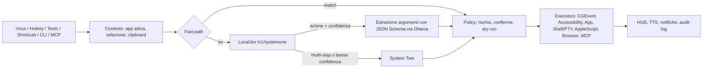

# RedOS – Piano di progetto

Assistente AI per macOS che vive nella menu bar: riceve comandi a voce o testo, decide l'azione con un
modello "System One" locale (Jev via LocalJev) e controlla il Mac (mouse, tastiera, app, terminale, CLI).

## Decisioni

| Tema | Scelta |
|---|---|
| Nome / wake word | **RedOS** / "Hey RedOS" (nota: esiste una distro Linux "RED OS", valutare prima di distribuire) |
| Piattaforma | macOS 26+, Apple Silicon, app nativa Swift 6 / SwiftUI, non sandboxed |
| Build | SwiftPM + `Makefile` (Xcode non richiesto) |
| Firma | Certificato self-signed stabile (`make cert`). Niente Developer ID / notarizzazione per ora |
| Lingue | UI e comandi multilingua configurabili: `en` (base) + `it`, estendibili aggiungendo `*.lproj` e locale STT |
| Wake word | openWakeWord (ONNX Runtime, on-device) |
| System One | Protocollo Jev (`choice`). Default: decisione nativa su Ollama dai logprob del modello; opzionale: LocalJev / Jev via HTTP |
| System Two | Cloud opzionale (GitHub Models/Copilot, Claude, OpenAI, Gemini) o modello locale on-demand |
| Repo | GitHub, pubblico |

## Hardware di riferimento: M3, 24 GB

I modelli migliori del bake-off LocalJev (Qwen3.6-35B-A3B ~20 GB, Gemma 4 26B-A4B ~16 GB in 4 bit)
non stanno comodi in 24 GB insieme a macOS e alle app. Strategia a livelli:

0. **Fast path deterministico** (0 RAM, ~0 ms): grammatica per i comandi frequenti ("apri X", "volume 30").
1. **System One**: LocalJev + Ollama con modello piccolo, residente (`keep_alive` lungo).
   Candidati da misurare in M2.5: Gemma 4 E4B e altri modelli ≤ 8B; il task (scelta tra ~20 azioni)
   è più semplice dei benchmark generici. Candidato extra: adapter OpenAI-compatibile interno basato su
   Apple Foundation Models (nessuna RAM aggiuntiva per il processo).
2. **System Two**: cloud di default; in modalità offline un modello locale caricato on-demand.

Le probabilità di LocalJev sono auto-dichiarate dal modello (non logit): le soglie si tarano sul nostro eval.

### Misure M2 (M3 24 GB, Ollama 0.40, `gemma4:e4b-it-qat`, modello caldo)

| Backend | Latenza decisione | Note |
|---|---|---|
| LocalJev originale | 12-40 s | Ollama ignora `enable_thinking`: Gemma 4 ragiona prima di rispondere |
| LocalJev + patch `reasoning_effort: none` | ~4.7 s | JSON di probabilità auto-dichiarate; "che tempo fa?" → `app.open` (errore) |
| **Nativo logprob** (default) | **~0.8-1.7 s** | 1 token generato, probabilità lette dal modello; 6/6 corretti |
| `gemma4:12b-it-qat` logprob | ~2.2 s | più lento e sovra-confidente (p=1.00 ovunque) |

Estrazione argomenti: JSON mode (+~1.3 s). Lo schema JSON per richiesta costa ~1 s di compilazione
grammatica in Ollama, quindi la validazione stretta resta in `ActionRegistry`.

### Eval M2.5 (`make eval`, 70 comandi it/en in `eval/commands.jsonl`, 26 da NON eseguire)

| Variante | Accuratezza | Azioni errate eseguite | Latenza p50 / p95 |
|---|---|---|---|
| Baseline M2 | 88.6% | 5/26 "none" eseguiti | 1.41 / 1.93 s |
| + catalogo con confini chiari, fast path senza comandi composti | 94.3% | 1 (coordinate inventate) | 1.48 / 1.93 s |
| **+ numeri ammessi solo se detti dall'utente** (default) | **94.3%** | **0** | **1.49 / 1.93 s** |
| LocalJev patchato, stesso modello | 38.6% | 2 | 4.03 / 4.76 s |

- Soglia default **0.5**: copertura 95.5% delle azioni attese, precisione 100%, Brier 0.058.
- Estrazione "a catena" (riusa la conversazione della decisione): stessa latenza, ma argomenti migliori
  (senza catena: "batti il testo grazie mille" → testo sbagliato, coordinate inventate 960,540).
- La latenza da 2-4 s di M2 dipendeva dal carico macchina: a regime decisione 0.8 s + estrazione 0.75 s.
- Limite: catalogo tarato sullo stesso set (rischio overfitting). Da ampliare con comandi reali
  presi dal registro azioni (`route`, `confidence` sono già registrati).

## Architettura

- Domanda Jev: `action` (choice sul catalogo azioni + `none`). Il rischio NON lo decide il modello: è
  dichiarato da ogni azione; le azioni scelte dal modello sopra `safe` chiedono conferma se p < 0.85.
- LocalJev (submodule + patch in `Vendor/patches/`) si compila con `make localjev` e si avvia con
  `make localjev-run`; RedOS lo usa se `systemOne.jevURL` è impostato. Lo stesso client può puntare a
  Jev cloud cambiando base URL.
- Ordine degli executor: integrazioni dirette (CLI/AppleScript/Shortcuts) → Accessibility API → visione.

## Sicurezza

- Livelli di rischio `safe` / `moderate` / `dangerous`; conferma obbligatoria per azioni distruttive.
- Kill switch globale, indicatore visibile durante il controllo di mouse/tastiera, audit log locale.
- Contenuti letti da schermo/pagine/file mai trattati come istruzioni (difesa da prompt injection).
- Segreti solo nel Portachiavi; server locali solo su loopback con chiave.

## Funzioni aggiuntive (backlog)

Routine/macro (anche "teach by demonstration"), memoria persistente, trigger (orari, rete, app),
azioni sul testo selezionato, TTS, plugin via MCP, controllo costi cloud, modalità solo-offline,
cronologia comandi, bridge terminale ("perché è fallito l'ultimo comando?"), server MCP per pilotare
RedOS da VS Code / altri agenti.

## Aggiornamenti

- **Locale**: `make install` (build, firma, copia in `/Applications`).
- **Remoto**: Sparkle 2 con appcast firmato EdDSA su GitHub Releases/Pages, canali stable/beta.
  Ogni release va firmata con la **stessa identità** (`RedOS Development`) per non perdere i permessi.
- Senza notarizzazione il primo download richiede "Apri comunque" in Impostazioni > Privacy e sicurezza.
- In futuro: Developer ID + notarizzazione, Homebrew tap, GitHub Actions per build/test/release.

## Roadmap

| Fase | Contenuto | Stato |
|---|---|---|
| M0 | Repo, SwiftPM, menu bar, onboarding permessi, firma stabile, Makefile, localizzazione | ✅ |
| M1 | Pannello testo stile Spotlight, hotkey globale, ActionRegistry, executor base, Policy, audit log, fast path it/en | ✅ |
| M2 | System One: protocollo Jev, decisione via logprob su Ollama, estrazione argomenti, LocalJev opzionale | ✅ |
| M2.5 | Eval su comandi reali it/en, scelta modello, soglie | ✅ |
| M3 | System Two: provider cloud + locale, Portachiavi | |
| M4 | Voce: push-to-talk, SpeechAnalyzer/WhisperKit, TTS, openWakeWord | |
| M5 | Agente multi-step: osserva/agisci, Accessibility tree, Shell/PTY, HUD, kill switch | |
| M6 | MCP client e server | |
| M7 | Sparkle, pacchetti release | |
| M8 | Extra (routine, memoria, trigger, costi) | |
| M9 | CI/CD GitHub Actions | |
