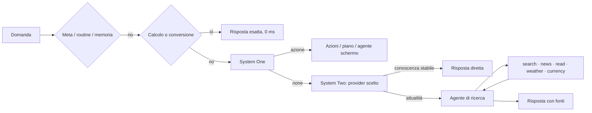
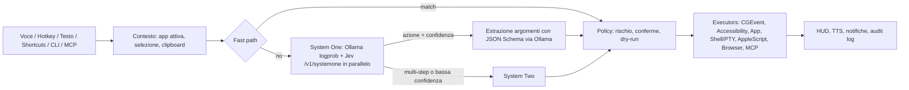

# RedOS – Piano di progetto

Assistente AI per macOS che vive nella menu bar: riceve comandi a voce o testo, decide l'azione con un
modello "System One" (decisione via logprob su Ollama, più Jev/OpenJev su Codiv per il tipo di richiesta) e
controlla il Mac (mouse, tastiera, app, terminale, CLI).

## Decisioni

| Tema | Scelta |
|---|---|
| Nome / wake word | **RedOS** / "Hey RedOS" (nota: esiste una distro Linux "RED OS", valutare prima di distribuire) |
| Piattaforma | macOS 26+, Apple Silicon, app nativa Swift 6 / SwiftUI, non sandboxed |
| Build | SwiftPM + `Makefile` (Xcode non richiesto) |
| Firma | Certificato self-signed stabile (`make cert`). Niente Developer ID / notarizzazione per ora |
| Lingue | UI e comandi multilingua configurabili: `en` (base) + `it`, estendibili aggiungendo `*.lproj` e locale STT |
| Wake word | openWakeWord (ONNX Runtime, on-device) |
| System One | Protocollo Jev. Decisione dell'azione su Ollama dai logprob del modello; in parallelo Jev (OpenJev su Codiv o server Jev) per il tipo di richiesta. LocalJev rimosso in M10 |
| System Two | Cloud opzionale (GitHub Models/Copilot, Claude, OpenAI, Gemini) o modello locale on-demand |
| Repo | GitHub, pubblico |

## Hardware di riferimento: M3, 24 GB

I modelli migliori del bake-off LocalJev (Qwen3.6-35B-A3B ~20 GB, Gemma 4 26B-A4B ~16 GB in 4 bit)
non stanno comodi in 24 GB insieme a macOS e alle app. Strategia a livelli:

0. **Fast path deterministico** (0 RAM, ~0 ms): grammatica per i comandi frequenti ("apri X", "volume 30").
1. **System One**: LocalJev + Ollama con modello piccolo, residente (`keep_alive` lungo).
   Candidati da misurare in M2.5: Gemma 4 E4B e altri modelli ≤ 8B; il task (scelta tra ~20 azioni)
   è più semplice dei benchmark generici. Candidato extra: adapter OpenAI-compatibile interno basato su
   Apple Foundation Models (nessuna RAM aggiuntiva per il processo).
2. **System Two**: cloud di default; in modalità offline un modello locale caricato on-demand.

Le probabilità di LocalJev sono auto-dichiarate dal modello (non logit): le soglie si tarano sul nostro eval.

### Misure M2 (M3 24 GB, Ollama 0.40, `gemma4:e4b-it-qat`, modello caldo)

| Backend | Latenza decisione | Note |
|---|---|---|
| LocalJev originale | 12-40 s | Ollama ignora `enable_thinking`: Gemma 4 ragiona prima di rispondere |
| LocalJev + patch `reasoning_effort: none` | ~4.7 s | JSON di probabilità auto-dichiarate; "che tempo fa?" → `app.open` (errore) |
| **Nativo logprob** (default) | **~0.8-1.7 s** | 1 token generato, probabilità lette dal modello; 6/6 corretti |
| `gemma4:12b-it-qat` logprob | ~2.2 s | più lento e sovra-confidente (p=1.00 ovunque) |

Estrazione argomenti: JSON mode (+~1.3 s). Lo schema JSON per richiesta costa ~1 s di compilazione
grammatica in Ollama, quindi la validazione stretta resta in `ActionRegistry`.

### Eval M2.5 (`make eval`, 70 comandi it/en in `eval/commands.jsonl`, 26 da NON eseguire)

| Variante | Accuratezza | Azioni errate eseguite | Latenza p50 / p95 |
|---|---|---|---|
| Baseline M2 | 88.6% | 5/26 "none" eseguiti | 1.41 / 1.93 s |
| + catalogo con confini chiari, fast path senza comandi composti | 94.3% | 1 (coordinate inventate) | 1.48 / 1.93 s |
| **+ numeri ammessi solo se detti dall'utente** (default) | **94.3%** | **0** | **1.49 / 1.93 s** |
| LocalJev patchato, stesso modello | 38.6% | 2 | 4.03 / 4.76 s |

- Soglia default **0.5**: copertura 95.5% delle azioni attese, precisione 100%, Brier 0.058.
- Estrazione "a catena" (riusa la conversazione della decisione): stessa latenza, ma argomenti migliori
  (senza catena: "batti il testo grazie mille" → testo sbagliato, coordinate inventate 960,540).
- La latenza da 2-4 s di M2 dipendeva dal carico macchina: a regime decisione 0.8 s + estrazione 0.75 s.
- Limite: catalogo tarato sullo stesso set (rischio overfitting). Da ampliare con comandi reali
  presi dal registro azioni (`route`, `confidence` sono già registrati).

### Richieste in più passi (anticipo di M3, System Two locale)

- System One ha l'opzione `multi_step`; `OllamaPlanner` (stesso modello, JSON mode) produce una lista
  di azioni del catalogo (max 6), ognuna validata e controllata dalla policy.
- Il piano è **sempre mostrato e confermato** (Invio) prima di eseguirlo; i passi girano in ordine e si
  fermano al primo errore. Nuova azione `url.open` (solo http/https).
- "apri chrom e naviga su google.com" → `app.open Google Chrome` + `url.open google.com (Google Chrome)`.
  Decisione ~1.2 s + piano ~3.5 s.
- Eval con 78 comandi (catalogo più ampio): accuratezza 89.7%, copertura 89.6%, 1 azione `safe`
  sbagliata eseguita ("spegni Xcode" → apre Xcode), latenza p50 1.74 s.

### M3: System Two con provider a scelta

- Tutto ciò che System One non esegue (nessuna azione, incerto, più passi) va a System Two, che
  restituisce un **piano** (sempre confermato) oppure una **risposta** testuale mostrata nel pannello.
- Provider: Ollama locale (default, offline), **GitHub Copilot CLI** (abbonamento Copilot, tool e MCP
  disattivati, eseguito in una cartella vuota), OpenAI, Anthropic Claude, Google Gemini (endpoint
  OpenAI-compatibile). Chiavi API nel Portachiavi; finestra Impostazioni con elenco modelli e test.
- GitHub Models è stato dismesso il 30/07/2026: per Copilot si usa la CLI ufficiale.
- Misure: Ollama piano ~3.8 s / risposta ~2.7 s; Copilot `claude-haiku-5.5` piano ~7.3 s / risposta ~4.4 s.

### Ottimizzazione velocità (09/10/2026)

Candidati provati con `make eval` (78 comandi) e `RedOSEval --system-two` (30 richieste):

| System One | Accuratezza | Azioni errate auto | Decisione p50 |
|---|---|---|---|
| gemma4:e4b logprob (prima) | 89.7% | 1 | 0.82 s |
| **gemma4:e4b logprob + esempi** | **92.3%** | **0** | **0.25 s** |
| gemma4:e2b logprob + esempi | 89.7% | 4 | 0.14 s |
| qwen3.5:4b logprob + esempi | 84.6% | 4 | 0.46 s |
| tev1:4b (modello decisionale, `/v1/systemone` nativo di Ollama) | 82.1% | 3 | 1.24 s |
| tev1:0.8b / laya 322M-421M | 61.5% / 38.5% | 5-9 | 0.23 / 0.8 s |

- Ollama 0.40 espone **nativamente l'API Jev** (`/v1/systemone`) per modelli decisionali (tev1, nimble,
  clef, laya): provati, ma su comandi it/en per il Mac sono più lenti o meno accurati della nostra
  decisione via logprob. Il client `JevHTTPSystemOne` li supporta comunque (modello configurabile).
- **Cache KV**: Gemma 4 (sliding window) riusa la cache solo con prompt costanti oltre ~512 token; sotto
  rielabora tutto a ogni richiesta (~0.75-1.5 s). Gli esempi few-shot allungano il prompt: più accurato
  *e* più veloce. Con `OLLAMA_NUM_PARALLEL=2` (`make ollama-tune`) decisione e piani non si rubano la
  cache: prompt 1.85 s → 0.15 s.
- **Estrazione argomenti** con `gemma4:e2b-it-qat`: 0.44 s invece di 0.79 s, argomenti 97.9%.
- **System Two** gemma4:e4b con prompt lungo + esempi: 86.7% (prima 80%), p50 1.0 s (prima ~2.8-3.8 s).
  Altri modelli (e2b, qwen3.5:4b, lfm2.5) 10-60%.
- **Holdout** (30 comandi nuovi mai usati per tarare): System One 90.0%, 1 azione `safe` errata
  ("butta giù Safari" → apre Safari), totale p50 0.64 s; System Two 100% (12/12), p50 1.1 s.

| Percorso | Prima | Dopo |
|---|---|---|
| Azione singola (System One + argomenti) | 1.74 s | **0.64 s** |
| Domanda / più passi (System One + System Two locale) | ~4.8 s | **~1.3 s** |

### Flusso multi-step rivisto

- Comandi composti da parti semplici ("apri Chrome e vai su bip.red", "apri Note e poi scrivi...")
  diventano un piano **istantaneo** dal fast path (divisione su virgole/congiunzioni, 0 ms).
- Gli altri multi-step vanno sempre al **planner locale** (gemma4:e4b, ~1 s); il provider configurato
  (es. Copilot) riceve solo domande e comandi poco chiari.
- `PlanSimplifier`: niente avvii ripetuti; "apri browser + apri URL" diventa un solo `url.open`.
- Conferma solo se serve: piani dal fast path seguono la policy; piani dal modello partono da soli se
  tutti i passi sono `safe`. Le conferme si danno anche a voce ("sì", "conferma", "no", "annulla").
- Le frasi dette dall'app usano la lingua della voce (non quella dell'interfaccia).
- Parametri URL validati prima dell'esecuzione (`.webAddress`).

### M5: schermo, shell, agente

- **Accessibility**: `ScreenReader` legge la finestra in primo piano e la barra dei menu (max 150 elementi,
  testo visibile), con numeri `#n` per l'agente. Azioni: `ui.press` (pulsanti, link, schede, menu e voci di
  menu anche chiusi, per nome), `ui.fill` (campo per nome, digitazione reale), `ui.read` (testo mostrato).
- **Shell**: `shell.run` (zsh login, cartella home, timeout 60 s, output max 6000 caratteri), sempre
  `dangerous` quindi confermato. Niente PTY: i programmi interattivi non sono supportati.
- **Agente** osserva/agisci: il planner risponde `{"agent":true}` quando serve guardare lo schermo ("il primo
  risultato", moduli); ogni passo è validato, controllato dalla policy e registrato (`route: agent`), max 12
  passi, azioni `dangerous` rifiutate, si ferma se ripete il passo appena riuscito o un passo che fallisce.
  gemma4:e4b locale: ~1.3 s per passo; 5/5 scelte corrette su schermate di prova (`make test-live`).
- **HUD** non attivante in alto a destra durante l'esecuzione (passo corrente, pulsante Ferma) e **kill
  switch** ⌃⌥⎋: annullano il task, i comandi shell vengono terminati.
- Fast path: "clicca su X", "premi X", "apri il menu X", "scrivi X nel campo Y", "leggimi lo schermo",
  "esegui il comando X"; i comandi composti valgono anche qui ("apri Safari e premi Accedi").
- Eval (89 comandi): System One 88.8%, 0 azioni errate eseguite a soglia 0.5, p50 0.69 s. Holdout (35):
  82.9%; errori nuovi su richieste ambigue ("key in my email" → `ui.fill`) e "svuota il cestino" →
  `shell.run` (bloccato dalla conferma). "press OK" sbaglia col modello ma il fast path lo copre.

### M8: routine, memoria, trigger, selezione, costi

- **Routine**: "crea la routine X: …" trasforma il corpo in passi validati subito (fast path o planner),
  salvati in `routines.json`; "avvia la routine X" li esegue senza modelli (policy del fast path).
- **Trigger**: orario giornaliero (anche solo feriali) e apertura di un'app (`TriggerCenter`, controllo ogni
  20 s / notifiche NSWorkspace). Senza richiesta esplicita, i passi sopra `safe` chiedono conferma.
- **Memoria**: "ricorda che…", "dimentica…", "cosa ricordi?" (`memory.json`, max 50 fatti). I fatti vanno a
  System Two e all'agente nel messaggio utente (il prompt di sistema resta in cache); le frasi con
  "mio/my" saltano fast path e System One. Live: "apri il mio editor" → `app.open Visual Studio Code`.
- **Testo selezionato**: richieste con "selezionato/selection" leggono la selezione via Accessibility e la
  passano al provider come dati delimitati; live: un'istruzione iniettata nella selezione viene tradotta,
  non eseguita.
- **Costi**: `MeteredClient` conta richieste e token stimati (caratteri/4) per i provider cloud; oltre il
  limite giornaliero usa il modello locale. Interruttore "Solo offline". Comandi meta: `MetaCommand`.

### Orchestratore delle domande e ricerca web (09/10/2026)

- `Calculator` (parser ricorsivo, niente NSExpression) e `UnitConverter` (Foundation `Dimension`, valute
  ECB/Frankfurter) rispondono prima di qualsiasi modello: "2+2" non passa più da Copilot.
- Il planner/assistente risponde `{"research":"<query>"}` per tutto ciò che è attuale; il `ResearchAgent` usa il
  client di System Two (cloud o locale), max 4 strumenti, primo strumento scelto senza modello (ricerca o
  notizie; per il meteo decide il modello), JSON non valido ritentato una volta, fonti mostrate sempre.
- Strumenti senza chiavi: DuckDuckGo HTML, Google News RSS, Open-Meteo, Frankfurter. `read` accetta solo
  http(s) pubblici su porte standard (niente localhost, reti private, .local, link-local) anche dopo i redirect.
- Live (gemma4:e4b locale): "chi ha diretto Dune parte due?" 10 s, "che tempo fa domani a Milano?" 7 s,
  "ultime notizie su Apple" 12 s; 4/4 domande attuali instradate alla ricerca. Eval System Two 83.9%.
- Crash risolti: `.glassEffect` nel pannello borderless andava in ricorsione infinita in SwiftUI (sostituito da
  `.regularMaterial`); callback Carbon degli hotkey ora passano dalla main queue. Pannello e HUD hanno ora
  finestre di dimensione fissa: il ridimensionamento automatico (`sizingOptions`) innescava un ciclo di layout
  riprodotto con una prova di stress (crash prima, 3/3 senza crash dopo).

### Risposte ricche e diagrammi (09/10/2026)

- **Attività** nel pannello: `ActivityReporter` (TaskLocal) riceve le fasi senza passare callback ovunque:
  "Capisco la richiesta…" (System One), "Ragiono…" (System Two), "Cerco nel web: …", "Leggo …",
  "Controllo il meteo / il cambio", "Scrivo la risposta…", "Disegno il diagramma (…)".
- **Risposte ricche**: testo, grafico Swift Charts (`ChartSpec`: meteo min/max automatico, cambio ultimo mese,
  serie numeriche proposte dal modello e validate), immagine (og:image delle pagine lette: solo URL presenti
  nei risultati, https pubblici) e fonti.
- **Diagrammi** con [diagram-design](https://github.com/cathrynlavery/diagram-design) (MIT, v2.6): guida di
  stile, primitive, riferimenti e un esempio per ciascuno dei 44 tipi in `Resources/DiagramDesign` (1.2 MB).
  Il planner risponde `{"diagram":"…"}`; `DiagramDesigner` sceglie il tipo (1 chiamata) e genera l'HTML/SVG con
  guida + tipo + esempio come contesto (~20k token), salvato in `Application Support/RedOS/Diagrams` e mostrato
  in una finestra WebKit senza JavaScript (link nel browser). Copilot `claude-haiku-5.5`: flowchart del login
  con 2FA in ~90 s, fedele allo stile. Con Ollama il contesto si allarga da solo (`num_ctx` fino a 32k) ma
  la qualità è inferiore: per i diagrammi conviene un provider cloud.

### Comprensione e velocità (09/10/2026)

- **Problema**: "a chi è assegnata questa MR" finiva all'agente schermo, che apriva il Terminale e scriveva;
  ogni chiamata Copilot costava ~5 s (avvio della CLI) e i diagrammi oltre 1 minuto senza segnali.
- **Domande sullo schermo**: `ScreenQuestion` (deterministico: verbo interrogativo + riferimento deittico
  "questa pagina/MR", "sullo schermo") e l'opzione `look` del planner leggono il contenuto della finestra
  (Accessibility, fino a 16k caratteri, URL della pagina) e rispondono senza agire.
- **Contesto**: System Two riceve "On screen now: app — titolo finestra" per risolvere "questa/this".
- **Agente limitato**: solo `ui.press`, `ui.fill`, `ui.read`, `scroll`, `url.open`, `app.open`.
- **Priorità** (Impostazioni): Precisione (predefinita: soglia System One almeno 0.85, piani e agente al
  provider) o Velocità (piani e agente sul modello locale; diagrammi con ragionamento ridotto).
- **Copilot via ACP**: un processo `copilot --acp` persistente invece di `copilot -p` per ogni chiamata.
  `--available-tools=none` toglie davvero i tool (con la lista vuota il modello provava a creare il file
  del diagramma, negato: risposta vuota nel ~50% dei casi) e riduce l'input da ~19k a ~3.5k token.
  `claude-haiku-5.5`: risposte e piani 1–2.5 s (prima 4–6 s), domanda sullo schermo 2.4 s.
- **Diagrammi**: restano 60–90 s (~5k token di HTML + ragionamento; `--reasoning-effort low` ~15% più
  veloce, `none` non risponde), ma il pannello mostra "Scrivo… N caratteri" mentre arrivano.

### M4.1: wake word "Hey Red" (10/10/2026)

- Modello dedicato `hey_red.onnx` (openWakeWord, classificatore 16×96 → punteggio) + modelli di feature di
  openWakeWord v0.5.1 (`melspectrogram.onnx`, `embedding_model.onnx`) in `Resources/WakeWord` (2.6 MB).
- Target `RedOSWakeWord` con ONNX Runtime 1.24.2 (SwiftPM, statico: l'app passa a ~40 MB).
  `WakeWordDetector` replica lo streaming di openWakeWord: blocchi da 1280 campioni (80 ms) + 480 di
  contesto → mel (/10 + 2) → ultimi 76 frame → embedding → ultimi 16 embedding → punteggio.
- `WakeWordListener`: microfono a 16 kHz, soglia regolabile (Sensibilità), pausa di 2 s dopo un rilevamento;
  si ferma mentre si detta il comando. Dopo "Hey Red" il comando parte alla pausa (1.5 s senza parole nuove,
  6 s senza parole, 20 s al massimo).
- Verifica: `say "Hey Red"` 0.90, "Hey red, apri Safari" 0.72, frasi diverse < 0.01 (test automatici);
  prova reale dagli altoparlanti al microfono: rilevata e comando trascritto. La pronuncia italiana
  (voce Alice) non supera la soglia: il modello è addestrato su "Hey Red" in inglese.

### M6: MCP client e server (10/10/2026)

- **Server** (`MCPServer`, `MCPHTTPEndpoint`, `LocalHTTPServer` su Network.framework): Streamable HTTP
  solo JSON su `127.0.0.1:47821/mcp`, interfaccia loopback, token bearer nel Portachiavi (confronto a tempo
  costante), rifiuto di richieste con `Origin` (browser, DNS rebinding) e di Host diversi. Tool
  `run_command` (il comando passa dal pannello come se fosse digitato: stesse conferme, risposta restituita al
  client) e `read_screen` (opzionale). Spento di default; "Copia per VS Code / Claude Code".
- **Client** (`MCPStdioClient`, `MCPHub`): server stdio da `mcp.json` (formato `mcpServers` di Claude
  Desktop), PATH della shell di login per `npx`/`uvx`. I tool diventano azioni `mcp.<server>.<tool>` solo per
  System Two (System One resta sul catalogo base): `readOnlyHint` → safe, `destructiveHint: false` →
  moderate, altrimenti dangerous (conferma). Argomenti convertiti ai tipi dello schema.
- Verifica: 8 test (protocollo, sicurezza HTTP, server Python stdio reale); prova live: curl → `run_command`
  "quanto fa 17 per 23" in 0.3 s; "usa lo strumento MCP add per sommare 1234 e 4321" via MCP → planner Copilot
  → `mcp.calc.add` → "5555" (10 s).

## Architettura

- Domanda Jev: `action` (choice sul catalogo azioni + `none`). Il rischio NON lo decide il modello: è
  dichiarato da ogni azione; le azioni scelte dal modello sopra `safe` chiedono conferma se p < 0.85.
- Jev via HTTP (`JevHTTPSystemOne`): Codiv (`api.codiv.ai`) o qualsiasi server compatibile, scelto in
  Impostazioni > Modelli > Decisioni rapide. LocalJev (submodule + patch) è stato rimosso in M10.
- Ordine degli executor: integrazioni dirette (CLI/AppleScript/Shortcuts) → Accessibility API → visione.

## Sicurezza

- Livelli di rischio `safe` / `moderate` / `dangerous`; conferma obbligatoria per azioni distruttive.
- Kill switch globale, indicatore visibile durante il controllo di mouse/tastiera, audit log locale.
- Contenuti letti da schermo/pagine/file mai trattati come istruzioni (difesa da prompt injection).
- Segreti solo nel Portachiavi; server locali solo su loopback con chiave.

## Funzioni aggiuntive (backlog)

Teach by demonstration, trigger di rete, plugin via MCP, bridge terminale ("perché è fallito l'ultimo
comando?"), server MCP per pilotare RedOS da VS Code / altri agenti.

## Aggiornamenti

- **Locale**: `make install` (build, firma, copia in `/Applications`).
- **Remoto**: Sparkle 2.10 con appcast firmato EdDSA (`appcast.xml` nel repo, archivi su GitHub Releases),
  canali stable/beta (opzione nelle Impostazioni). `make release` crea zip + dmg, firma EdDSA (chiave nel
  Portachiavi, account `redos`) e aggiunge l'item all'appcast; `make publish` crea la release GitHub e
  pubblica l'appcast solo dopo che gli archivi sono scaricabili.
  Ogni release va firmata con la **stessa identità** (`RedOS Development`) per non perdere i permessi:
  Sparkle verifica anche che il nuovo bundle soddisfi il requisito di firma di quello installato.
- Sparkle senza XPC services (app non sandboxed) e senza hardened runtime (certificato self-signed senza
  Team ID: la library validation rifiuterebbe il framework).
- Senza notarizzazione il primo download richiede "Apri comunque" in Impostazioni > Privacy e sicurezza.
- In futuro: Developer ID + notarizzazione, Homebrew tap.
- **CI/CD** (M9): `ci.yml` su `macos-26` a ogni push/PR (SwiftLint, test, bundle firmato ad-hoc);
  `release.yml` manuale (canale stable/beta) importa l'identità self-signed e la chiave Sparkle dai
  secret (`scripts/setup-release-secrets.sh`) in un portachiavi temporaneo, poi `make release` +
  `make publish`. Dependabot per Sparkle e per le action.

## Roadmap

| Fase | Contenuto | Stato |
|---|---|---|
| M0 | Repo, SwiftPM, menu bar, onboarding permessi, firma stabile, Makefile, localizzazione | ✅ |
| M1 | Pannello testo stile Spotlight, hotkey globale, ActionRegistry, executor base, Policy, audit log, fast path it/en | ✅ |
| M2 | System One: protocollo Jev, decisione via logprob su Ollama, estrazione argomenti, LocalJev opzionale | ✅ |
| M2.5 | Eval su comandi reali it/en, scelta modello, soglie | ✅ |
| M3 | System Two: provider cloud + locale, Portachiavi | ✅ |
| M4 | Voce: push-to-talk (⌃⌥Spazio), SpeechAnalyzer on-device it/en, risposte vocali (TTS) | ✅ |
| M4.1 | Wake word "Hey Red" (openWakeWord su ONNX Runtime, modello dedicato) | ✅ |
| M5 | Agente multi-step: osserva/agisci, Accessibility tree, Shell, HUD, kill switch | ✅ |
| M6 | MCP client e server | ✅ |
| M7 | Sparkle, pacchetti release | ✅ |
| M8 | Extra (routine, memoria, trigger, costi) | ✅ |
| M9 | CI/CD GitHub Actions | ✅ |
| M10 | Jev come nucleo decisionale: intento + azione in una chiamata (OpenJev su Codiv), fallback locale | ✅ |
| M16 | Azioni mancanti: sistema (volume, luminosità, aspetto, media, blocco schermo), finestre, file, Calendario/Promemoria, Mail, Comandi rapidi | ✅ |
| M11 | Conversazione: ascolto continuo dopo la risposta, contesto del dialogo, interruzione mentre parla, voce a frasi in streaming | ✅ (streaming rimandato) |
| M12 | Correzioni in corsa: ascolto durante l'esecuzione, Jev classifica stop / modifica / aggiunta, ripianificazione | |
| M13 | Agente in tempo reale: ogni passo è una scelta Jev tra gli elementi a schermo (~100 ms), screenshot opzionali | |
| M14 | Comportamenti: regole dette a voce ("d'ora in poi…"), persona, preferenze per app | |
| M15 | Proattività: calendario, batteria, riunioni, notifiche; Jev decide se interrompere; briefing | |

### Verso un "maggiordomo" (piano del 10/10/2026)

Obiettivo: un assistente con cui parlare in tempo reale, che si può correggere mentre lavora e che
prende l'iniziativa al momento giusto. Ordine: M10 → M16 → M11 → M12 → M13 → M14 → M15.

- **Perché Jev**: risposte tipizzate (choice fino a 255 opzioni, noul, score) lette in un solo passaggio,
  70–500 ms anche con molte domande nella stessa richiesta, probabilità calibrate, nessuna risposta fuori
  schema (TypeSafe, "Introducing System One Models & Jev"; demo di Doom a ~10 decisioni/s). Adatto a tante
  piccole valutazioni continue: tipo di richiesta, azione, "devo interrompere?", "questa frase cambia il
  compito?", "quale elemento premo?".
- **Fornitore**: OpenJev (DiffusionGemma 26B-A4B, Apache-2.0) ospitato da Codiv (`api.codiv.ai`,
  100M token gratuiti). In locale OpenJev/MLX richiede ~16 GB solo per il modello: non sta su 24 GB con
  Ollama. **Tutto deve restare possibile offline**: senza rete o con "Solo offline" RedOS torna alla
  decisione via logprob su Ollama e al planner locale.
- **Privacy**: lo stato inviato a Jev contiene il comando e, dove serve, il contesto della finestra.
- **Voce**: per ora voci di sistema locali.
- **Rimosso** (M10): LocalJev (probabilità auto-dichiarate, 4–5 s). **Da togliere**: il client Copilot a riga
  di comando per
  le richieste (resta solo per trovare la CLI ed elencare i modelli); meno regex dove Jev classifica meglio.

### M10: Jev come nucleo decisionale (10/10/2026)

- `JevQuestion` (choice / noul / score) e `JevDeciding`: più domande sullo stesso stato in una richiesta;
  `JevHTTPSystemOne` le invia a `/v1/systemone` (Codiv: `https://api.codiv.ai`, modello `openjev-latest`,
  chiave nel Portachiavi, account `jev`).
- `JevIntentRouter`: una richiesta con due domande, **tipo** (azione, più passi, compito sullo schermo,
  domanda sullo schermo, conoscenza, informazione attuale, diagramma) e **azione** (catalogo + MCP).
  Domanda sullo schermo, ricerca, diagramma e agente partono senza la chiamata di pianificazione a System Two.
- Misure (`make eval-jev`, Codiv da Milano):

  | | Jev (Codiv) | Locale (gemma4:e4b logprob) |
  |---|---|---|
  | Tipo di richiesta (`eval/intents.jsonl`, 43) | **100%** | – (regex + System Two) |
  | Azione (`eval/commands.jsonl`, 89) | 88.8% con esempi (76.4% senza), 4 azioni errate eseguite | **92.3%**, 0 errate |
  | Latenza decisione | p50 0.68–0.80 s (modello 26–145 ms, il resto è rete/gateway) | **0.25 s** |

- Quindi `HybridRouter`: locale e Jev **in parallelo**. Un'azione sicura del modello locale parte subito
  (salvo una domanda sullo schermo / ricerca / diagramma con Jev ≥ 0.9 entro 0.7 s: "di cosa parla questa
  finestra?" non diventa `ui.read`); per tutto il resto decide il tipo di Jev; senza rete, con "Solo offline"
  o senza chiave lavora solo il locale (comportamento precedente).
- Prova dal vivo (via MCP): "di cosa parla questa finestra?" → risposta sul contenuto in ~5–6 s, "che tempo fa
  domani a Milano?" → previsioni in ~6.4 s, "chi ha scritto i Promessi Sposi?" ~2 s.
- Corretti nel frattempo: meteo (decodifica Open-Meteo rotta da `convertFromSnakeCase`: "temperature_2m" →
  "temperature2M"; "Milano" geocodificata in Texas con `count=1`), lettura delle app Electron (VS Code, Slack:
  `AXManualAccessibility`), server MCP che non ripartiva subito dopo un riavvio (porta ancora occupata).
- Da fare: "apri Calcolatrice" non trova l'app (nome localizzato di Calculator) → M16.

### M16: azioni mancanti (11/10/2026)

- 12 azioni nuove: `volume.set`, `brightness.set` (tasti multimediali), `media.control`, `appearance.set`,
  `screen.lock`, `shortcut.run` (`/usr/bin/shortcuts`), `window.arrange` (Accessibility), `file.find` /
  `file.open` (Spotlight), `calendar.agenda` / `reminder.add` (EventKit), `mail.draft` (solo bozza).
- App con nome localizzato ("Calcolatrice", "Impostazioni di Sistema"): catalogo con i nomi da
  `InfoPlist.loctable` / `*.lproj/InfoPlist.strings`.
- "esegui il comando rapido X" va a `shortcut.run`, non più a `shell.run`.
- `make eval`: decisione 86.7%, argomenti 95.7%, p50 0.26 s; tutti i campioni delle azioni nuove corretti.
- Dal vivo (via MCP): Calcolatrice aperta, volume, luminosità su/giù, comando rapido inesistente →
  "Shortcut not found". Le azioni che finiscono senza testo rispondono "Fatto." ai client MCP.
- Rimandati: Non disturbare (nessuna API pubblica; si può fare con un Comando rapido), Messaggi.

### M11: conversazione (10/10/2026)

- **Contesto**: `Conversation` (ultimi 6 scambi, dimenticati dopo 5 minuti di silenzio) entra nel prompt di
  System Two, dell'agente, delle domande sullo schermo e della ricerca web (qui senza i fatti ricordati).
  Dal vivo: "che tempo fa domani a Milano?" → "e a Roma?" dà il meteo di Roma; "chi ha scritto i Promessi
  Sposi?" → "e in che anno è nato?" → "1785".
- **Ascolto dopo la risposta**: dopo una richiesta a voce il microfono resta aperto (icona grigia) mentre
  RedOS parla e per 6 s dopo; se l'utente parla diventa la richiesta successiva, "sì"/"no" rispondono a una
  conferma, "grazie"/"basta così" chiudono. Impostazione: Generali > Continua ad ascoltare dopo la risposta.
- **Interruzione**: in questo ascolto il microfono usa la cancellazione d'eco di macOS (voice processing, ducking
  minimo). Misura: la voce di RedOS letta dal microfono passa da -38 dB a -66 dB (silenzio -61 dB); trascritta
  senza cancellazione è la frase intera, con cancellazione è vuota. Quindi qualsiasi parola trascritta è
  dell'utente: RedOS smette di parlare e ascolta.
- **Rimandato**: voce in streaming mentre il modello scrive (serve lo streaming nei 5 provider e nel JSON del
  planner); AVSpeechSynthesizer comincia già subito, il ritardo è tutto nel modello.
- Nota sviluppo: ogni build locale cambia il cdhash e il Portachiavi (partition list) chiede di nuovo il
  permesso; finché la finestra è aperta l'app è bloccata all'avvio (lettura della chiave Jev nel main thread).
