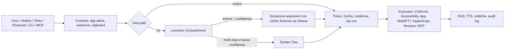

# RedOS – Piano di progetto

Assistente AI per macOS che vive nella menu bar: riceve comandi a voce o testo, decide l'azione con un
modello "System One" locale (Jev via LocalJev) e controlla il Mac (mouse, tastiera, app, terminale, CLI).

## Decisioni

| Tema | Scelta |
|---|---|
| Nome / wake word | **RedOS** / "Hey RedOS" (nota: esiste una distro Linux "RED OS", valutare prima di distribuire) |
| Piattaforma | macOS 26+, Apple Silicon, app nativa Swift 6 / SwiftUI, non sandboxed |
| Build | SwiftPM + `Makefile` (Xcode non richiesto) |
| Firma | Certificato self-signed stabile (`make cert`). Niente Developer ID / notarizzazione per ora |
| Lingue | UI e comandi multilingua configurabili: `en` (base) + `it`, estendibili aggiungendo `*.lproj` e locale STT |
| Wake word | openWakeWord (ONNX Runtime, on-device) |
| System One | Protocollo Jev (`choice`). Default: decisione nativa su Ollama dai logprob del modello; opzionale: LocalJev / Jev via HTTP |
| System Two | Cloud opzionale (GitHub Models/Copilot, Claude, OpenAI, Gemini) o modello locale on-demand |
| Repo | GitHub, pubblico |

## Hardware di riferimento: M3, 24 GB

I modelli migliori del bake-off LocalJev (Qwen3.6-35B-A3B ~20 GB, Gemma 4 26B-A4B ~16 GB in 4 bit)
non stanno comodi in 24 GB insieme a macOS e alle app. Strategia a livelli:

0. **Fast path deterministico** (0 RAM, ~0 ms): grammatica per i comandi frequenti ("apri X", "volume 30").
1. **System One**: LocalJev + Ollama con modello piccolo, residente (`keep_alive` lungo).
   Candidati da misurare in M2.5: Gemma 4 E4B e altri modelli ≤ 8B; il task (scelta tra ~20 azioni)
   è più semplice dei benchmark generici. Candidato extra: adapter OpenAI-compatibile interno basato su
   Apple Foundation Models (nessuna RAM aggiuntiva per il processo).
2. **System Two**: cloud di default; in modalità offline un modello locale caricato on-demand.

Le probabilità di LocalJev sono auto-dichiarate dal modello (non logit): le soglie si tarano sul nostro eval.

### Misure M2 (M3 24 GB, Ollama 0.40, `gemma4:e4b-it-qat`, modello caldo)

| Backend | Latenza decisione | Note |
|---|---|---|
| LocalJev originale | 12-40 s | Ollama ignora `enable_thinking`: Gemma 4 ragiona prima di rispondere |
| LocalJev + patch `reasoning_effort: none` | ~4.7 s | JSON di probabilità auto-dichiarate; "che tempo fa?" → `app.open` (errore) |
| **Nativo logprob** (default) | **~0.8-1.7 s** | 1 token generato, probabilità lette dal modello; 6/6 corretti |
| `gemma4:12b-it-qat` logprob | ~2.2 s | più lento e sovra-confidente (p=1.00 ovunque) |

Estrazione argomenti: JSON mode (+~1.3 s). Lo schema JSON per richiesta costa ~1 s di compilazione
grammatica in Ollama, quindi la validazione stretta resta in `ActionRegistry`.

### Eval M2.5 (`make eval`, 70 comandi it/en in `eval/commands.jsonl`, 26 da NON eseguire)

| Variante | Accuratezza | Azioni errate eseguite | Latenza p50 / p95 |
|---|---|---|---|
| Baseline M2 | 88.6% | 5/26 "none" eseguiti | 1.41 / 1.93 s |
| + catalogo con confini chiari, fast path senza comandi composti | 94.3% | 1 (coordinate inventate) | 1.48 / 1.93 s |
| **+ numeri ammessi solo se detti dall'utente** (default) | **94.3%** | **0** | **1.49 / 1.93 s** |
| LocalJev patchato, stesso modello | 38.6% | 2 | 4.03 / 4.76 s |

- Soglia default **0.5**: copertura 95.5% delle azioni attese, precisione 100%, Brier 0.058.
- Estrazione "a catena" (riusa la conversazione della decisione): stessa latenza, ma argomenti migliori
  (senza catena: "batti il testo grazie mille" → testo sbagliato, coordinate inventate 960,540).
- La latenza da 2-4 s di M2 dipendeva dal carico macchina: a regime decisione 0.8 s + estrazione 0.75 s.
- Limite: catalogo tarato sullo stesso set (rischio overfitting). Da ampliare con comandi reali
  presi dal registro azioni (`route`, `confidence` sono già registrati).

### Richieste in più passi (anticipo di M3, System Two locale)

- System One ha l'opzione `multi_step`; `OllamaPlanner` (stesso modello, JSON mode) produce una lista
  di azioni del catalogo (max 6), ognuna validata e controllata dalla policy.
- Il piano è **sempre mostrato e confermato** (Invio) prima di eseguirlo; i passi girano in ordine e si
  fermano al primo errore. Nuova azione `url.open` (solo http/https).
- "apri chrom e naviga su google.com" → `app.open Google Chrome` + `url.open google.com (Google Chrome)`.
  Decisione ~1.2 s + piano ~3.5 s.
- Eval con 78 comandi (catalogo più ampio): accuratezza 89.7%, copertura 89.6%, 1 azione `safe`
  sbagliata eseguita ("spegni Xcode" → apre Xcode), latenza p50 1.74 s.

### M3: System Two con provider a scelta

- Tutto ciò che System One non esegue (nessuna azione, incerto, più passi) va a System Two, che
  restituisce un **piano** (sempre confermato) oppure una **risposta** testuale mostrata nel pannello.
- Provider: Ollama locale (default, offline), **GitHub Copilot CLI** (abbonamento Copilot, tool e MCP
  disattivati, eseguito in una cartella vuota), OpenAI, Anthropic Claude, Google Gemini (endpoint
  OpenAI-compatibile). Chiavi API nel Portachiavi; finestra Impostazioni con elenco modelli e test.
- GitHub Models è stato dismesso il 30/07/2026: per Copilot si usa la CLI ufficiale.
- Misure: Ollama piano ~3.8 s / risposta ~2.7 s; Copilot `claude-haiku-5.5` piano ~7.3 s / risposta ~4.4 s.

### Ottimizzazione velocità (09/10/2026)

Candidati provati con `make eval` (78 comandi) e `RedOSEval --system-two` (30 richieste):

| System One | Accuratezza | Azioni errate auto | Decisione p50 |
|---|---|---|---|
| gemma4:e4b logprob (prima) | 89.7% | 1 | 0.82 s |
| **gemma4:e4b logprob + esempi** | **92.3%** | **0** | **0.25 s** |
| gemma4:e2b logprob + esempi | 89.7% | 4 | 0.14 s |
| qwen3.5:4b logprob + esempi | 84.6% | 4 | 0.46 s |
| tev1:4b (modello decisionale, `/v1/systemone` nativo di Ollama) | 82.1% | 3 | 1.24 s |
| tev1:0.8b / laya 322M-421M | 61.5% / 38.5% | 5-9 | 0.23 / 0.8 s |

- Ollama 0.40 espone **nativamente l'API Jev** (`/v1/systemone`) per modelli decisionali (tev1, nimble,
  clef, laya): provati, ma su comandi it/en per il Mac sono più lenti o meno accurati della nostra
  decisione via logprob. Il client `JevHTTPSystemOne` li supporta comunque (modello configurabile).
- **Cache KV**: Gemma 4 (sliding window) riusa la cache solo con prompt costanti oltre ~512 token; sotto
  rielabora tutto a ogni richiesta (~0.75-1.5 s). Gli esempi few-shot allungano il prompt: più accurato
  *e* più veloce. Con `OLLAMA_NUM_PARALLEL=2` (`make ollama-tune`) decisione e piani non si rubano la
  cache: prompt 1.85 s → 0.15 s.
- **Estrazione argomenti** con `gemma4:e2b-it-qat`: 0.44 s invece di 0.79 s, argomenti 97.9%.
- **System Two** gemma4:e4b con prompt lungo + esempi: 86.7% (prima 80%), p50 1.0 s (prima ~2.8-3.8 s).
  Altri modelli (e2b, qwen3.5:4b, lfm2.5) 10-60%.
- **Holdout** (30 comandi nuovi mai usati per tarare): System One 90.0%, 1 azione `safe` errata
  ("butta giù Safari" → apre Safari), totale p50 0.64 s; System Two 100% (12/12), p50 1.1 s.

| Percorso | Prima | Dopo |
|---|---|---|
| Azione singola (System One + argomenti) | 1.74 s | **0.64 s** |
| Domanda / più passi (System One + System Two locale) | ~4.8 s | **~1.3 s** |

### Flusso multi-step rivisto

- Comandi composti da parti semplici ("apri Chrome e vai su bip.red", "apri Note e poi scrivi...")
  diventano un piano **istantaneo** dal fast path (divisione su virgole/congiunzioni, 0 ms).
- Gli altri multi-step vanno sempre al **planner locale** (gemma4:e4b, ~1 s); il provider configurato
  (es. Copilot) riceve solo domande e comandi poco chiari.
- `PlanSimplifier`: niente avvii ripetuti; "apri browser + apri URL" diventa un solo `url.open`.
- Conferma solo se serve: piani dal fast path seguono la policy; piani dal modello partono da soli se
  tutti i passi sono `safe`. Le conferme si danno anche a voce ("sì", "conferma", "no", "annulla").
- Le frasi dette dall'app usano la lingua della voce (non quella dell'interfaccia).
- Parametri URL validati prima dell'esecuzione (`.webAddress`).

### M5: schermo, shell, agente

- **Accessibility**: `ScreenReader` legge la finestra in primo piano e la barra dei menu (max 150 elementi,
  testo visibile), con numeri `#n` per l'agente. Azioni: `ui.press` (pulsanti, link, schede, menu e voci di
  menu anche chiusi, per nome), `ui.fill` (campo per nome, digitazione reale), `ui.read` (testo mostrato).
- **Shell**: `shell.run` (zsh login, cartella home, timeout 60 s, output max 6000 caratteri), sempre
  `dangerous` quindi confermato. Niente PTY: i programmi interattivi non sono supportati.
- **Agente** osserva/agisci: il planner risponde `{"agent":true}` quando serve guardare lo schermo ("il primo
  risultato", moduli); ogni passo è validato, controllato dalla policy e registrato (`route: agent`), max 12
  passi, azioni `dangerous` rifiutate, si ferma se ripete il passo appena riuscito o un passo che fallisce.
  gemma4:e4b locale: ~1.3 s per passo; 5/5 scelte corrette su schermate di prova (`make test-live`).
- **HUD** non attivante in alto a destra durante l'esecuzione (passo corrente, pulsante Ferma) e **kill
  switch** ⌃⌥⎋: annullano il task, i comandi shell vengono terminati.
- Fast path: "clicca su X", "premi X", "apri il menu X", "scrivi X nel campo Y", "leggimi lo schermo",
  "esegui il comando X"; i comandi composti valgono anche qui ("apri Safari e premi Accedi").
- Eval (89 comandi): System One 88.8%, 0 azioni errate eseguite a soglia 0.5, p50 0.69 s. Holdout (35):
  82.9%; errori nuovi su richieste ambigue ("key in my email" → `ui.fill`) e "svuota il cestino" →
  `shell.run` (bloccato dalla conferma). "press OK" sbaglia col modello ma il fast path lo copre.

### M8: routine, memoria, trigger, selezione, costi

- **Routine**: "crea la routine X: …" trasforma il corpo in passi validati subito (fast path o planner),
  salvati in `routines.json`; "avvia la routine X" li esegue senza modelli (policy del fast path).
- **Trigger**: orario giornaliero (anche solo feriali) e apertura di un'app (`TriggerCenter`, controllo ogni
  20 s / notifiche NSWorkspace). Senza richiesta esplicita, i passi sopra `safe` chiedono conferma.
- **Memoria**: "ricorda che…", "dimentica…", "cosa ricordi?" (`memory.json`, max 50 fatti). I fatti vanno a
  System Two e all'agente nel messaggio utente (il prompt di sistema resta in cache); le frasi con
  "mio/my" saltano fast path e System One. Live: "apri il mio editor" → `app.open Visual Studio Code`.
- **Testo selezionato**: richieste con "selezionato/selection" leggono la selezione via Accessibility e la
  passano al provider come dati delimitati; live: un'istruzione iniettata nella selezione viene tradotta,
  non eseguita.
- **Costi**: `MeteredClient` conta richieste e token stimati (caratteri/4) per i provider cloud; oltre il
  limite giornaliero usa il modello locale. Interruttore "Solo offline". Comandi meta: `MetaCommand`.

## Architettura

- Domanda Jev: `action` (choice sul catalogo azioni + `none`). Il rischio NON lo decide il modello: è
  dichiarato da ogni azione; le azioni scelte dal modello sopra `safe` chiedono conferma se p < 0.85.
- LocalJev (submodule + patch in `Vendor/patches/`) si compila con `make localjev` e si avvia con
  `make localjev-run`; RedOS lo usa se `systemOne.jevURL` è impostato. Lo stesso client può puntare a
  Jev cloud cambiando base URL.
- Ordine degli executor: integrazioni dirette (CLI/AppleScript/Shortcuts) → Accessibility API → visione.

## Sicurezza

- Livelli di rischio `safe` / `moderate` / `dangerous`; conferma obbligatoria per azioni distruttive.
- Kill switch globale, indicatore visibile durante il controllo di mouse/tastiera, audit log locale.
- Contenuti letti da schermo/pagine/file mai trattati come istruzioni (difesa da prompt injection).
- Segreti solo nel Portachiavi; server locali solo su loopback con chiave.

## Funzioni aggiuntive (backlog)

Teach by demonstration, trigger di rete, plugin via MCP, bridge terminale ("perché è fallito l'ultimo
comando?"), server MCP per pilotare RedOS da VS Code / altri agenti.

## Aggiornamenti

- **Locale**: `make install` (build, firma, copia in `/Applications`).
- **Remoto**: Sparkle 2.10 con appcast firmato EdDSA (`appcast.xml` nel repo, archivi su GitHub Releases),
  canali stable/beta (opzione nelle Impostazioni). `make release` crea zip + dmg, firma EdDSA (chiave nel
  Portachiavi, account `redos`) e aggiunge l'item all'appcast; `make publish` crea la release GitHub e
  pubblica l'appcast solo dopo che gli archivi sono scaricabili.
  Ogni release va firmata con la **stessa identità** (`RedOS Development`) per non perdere i permessi:
  Sparkle verifica anche che il nuovo bundle soddisfi il requisito di firma di quello installato.
- Sparkle senza XPC services (app non sandboxed) e senza hardened runtime (certificato self-signed senza
  Team ID: la library validation rifiuterebbe il framework).
- Senza notarizzazione il primo download richiede "Apri comunque" in Impostazioni > Privacy e sicurezza.
- In futuro: Developer ID + notarizzazione, Homebrew tap, GitHub Actions per build/test/release.

## Roadmap

| Fase | Contenuto | Stato |
|---|---|---|
| M0 | Repo, SwiftPM, menu bar, onboarding permessi, firma stabile, Makefile, localizzazione | ✅ |
| M1 | Pannello testo stile Spotlight, hotkey globale, ActionRegistry, executor base, Policy, audit log, fast path it/en | ✅ |
| M2 | System One: protocollo Jev, decisione via logprob su Ollama, estrazione argomenti, LocalJev opzionale | ✅ |
| M2.5 | Eval su comandi reali it/en, scelta modello, soglie | ✅ |
| M3 | System Two: provider cloud + locale, Portachiavi | ✅ |
| M4 | Voce: push-to-talk (⌃⌥Spazio), SpeechAnalyzer on-device it/en, risposte vocali (TTS) | ✅ |
| M4.1 | Wake word "Hey RedOS" (openWakeWord: addestramento modello dedicato) | |
| M5 | Agente multi-step: osserva/agisci, Accessibility tree, Shell, HUD, kill switch | ✅ |
| M6 | MCP client e server | |
| M7 | Sparkle, pacchetti release | ✅ |
| M8 | Extra (routine, memoria, trigger, costi) | ✅ |
| M9 | CI/CD GitHub Actions | |
